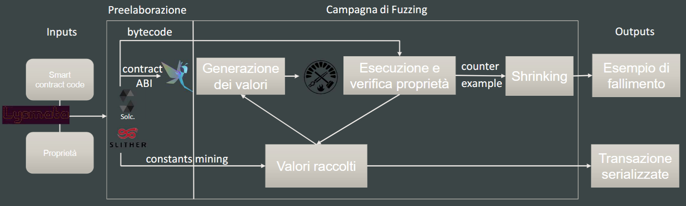

# AUTOMATED APPROACHES FOR SMART CONTRACT ANALYSIS

Internship project for achelor thesis

## Overview

This repository contains the source code and documentation for an automated vulnerability analysis system specifically designed for smart contracts written in Solidity. The project was developed during an internship. The internship focused on expanding my knowledge in Web3 technologies, with an emphasis on **Ethereum smart contracts** and the **Solidity programming language**.

The goal of the project is to identify common vulnerabilities in Solidity smart contracts while minimizing false positives. This was achieved by creating a **property-based tester** that automates the generation of test cases to validate the security of the smart contract code.

## Key Features

- **Automated Fuzzing**: The tool generates multiple test cases for smart contracts by defining properties that must always hold true during contract execution.
- **Property-based Testing**: The system uses the **Hypothesis** library to describe inputs instead of specifying them directly. It generates test cases based on these descriptions, and when a test case fails, it reports the specific input that caused the error.
- **Opcode Reversing**: An in-depth analysis of smart contract opcodes is performed to better understand the internal workings of the **Ethereum Virtual Machine (EVM)**.
- **Testing Environment**: The tests are run on a local testnet using **Anvil** from the Foundry framework, which proved more efficient than **Ganache** in this context.
- **Vulnerability Detection**: The system successfully identified vulnerabilities in several real-world examples, such as the DAO and Parity Wallet bugs.

## How It Works

1. **Define Properties**: Invariants are defined in the smart contract code, representing the properties that must always be satisfied (e.g., ensuring a user’s balance is sufficient before transferring tokens).
2. **Test Case Generation**: The fuzzer generates a sequence of transactions to test these properties.
3. **Transaction Execution**: Each transaction is sent to the smart contract on the testnet. If any property is violated during execution, the fuzzer logs the error.
4. **Shrinking**: Once a test case fails, the system attempts to find the smallest input that causes the failure, making it easier to diagnose the issue.



## Running Tests

```bash
python3 lysmata.py  -r 1000 -s 100  -c  tests/invariant_breaker.so
```
